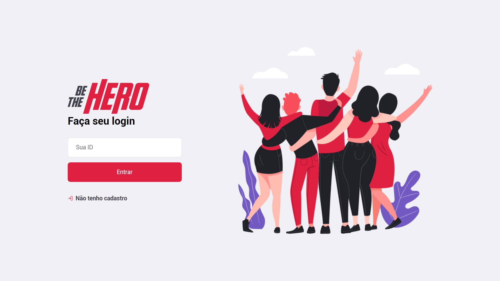
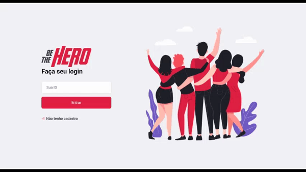

<h1 align="center"> Semana Omnistack 11.0 </h1>
<p align="center"> 🚀 Be The Hero: Aplicação desenvolvida na 11° Semana Ominstack feito pela Rocketseat.
 </p>
<p align="center">
  <a href="https://opensource.org/licenses/MIT">
    
  </a>
</p>

## Features
Para o desenvolvimento do projeto foi utilizada uma stack com as seguintes tecnologias:

- 💹 **Node Js** — Web framework que permite utilizar javascript tanto no frontend quanto no backend;
- 🛢️ **Knex** — Builder de SQL Query para Javascript
- 💅 **Styled Components** — Tecnologia para componentizar estilização CSS no React através do Javascript
- ⚛️ **React Js** — Livraria Javascript para construção de interfaces;
- ⚛️ **React Native** — Livraria que provê uma maneira eficiente de criar aplicações nativas para Android e iOS;

## Projeto

O Be The Hero é um projeto para que ONGs possam cadastrar casos em que necessitem de ajuda a fim de que as pessoas interessadas possam verificá-los e ajudar financeiramente em um caso específico.

## Getting started

<h1 align="center"></img></h1>

### Instalação - Backend
Clone o projeto em seu computador. Para instalar as dependências e executar o **Servidor** (modo desenvolvimento) execute:
```bash
cd backend
yarn install
yarn dev
```

### Instalação - Frontend (WEB)
Para iniciar o **Frontend** do React utilize os comandos:
```bash
cd frontend
yarn install
yarn start
```
Assim que o processo terminar, automaticamente será aberta no seu navegador a página `localhost:3000` contendo o Projeto desenvolvido no dia 3 de 5.

Resultado da aplicação Web:

<h1 align="center"></img></h1>

### Mobile

Para ver a aplicação mobile com o React Native, primeiro é necessário colocar o IP do seu servidor (ou computador) no arquivo `src/services/api.js`, e depois executar os comandos:
```bash
# NÃO é preciso executar a linha de baixo caso ja tenha o Expo (CLI) instalado
yarn global add install expo-cli
cd mobile
yarn install
yarn start
```

Assim que o processo terminar, automaticamente será aberta no seu navegador a página `localhost:19002`. Conecte seu emulador, ou teste o aplicativo por `LAN`: baixe o aplicativo *Expo* da Play Store ou App Store e em seguida escaneie o código QR.

Resultado da aplicação Mobile:

<h1 align="center"></img></h1>

### Insomnia 
Para testar a API do Be The Hero, baixe e instale o [Insomnia](https://insomnia.rest/download/) e em seguida clique na Workspace → `Import/Export` → `Import Data` → `From File` → e selecione o arquivo ` 	Insomnia_export.json` deste repositório.

## Licença

Esse projeto é licensiado pela MIT License - Veja a página da [licença](https://opensource.org/licenses/MIT) para detalhes
